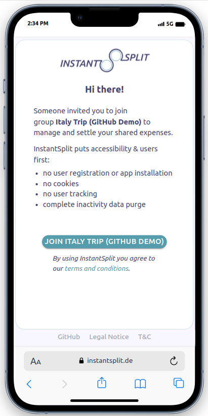
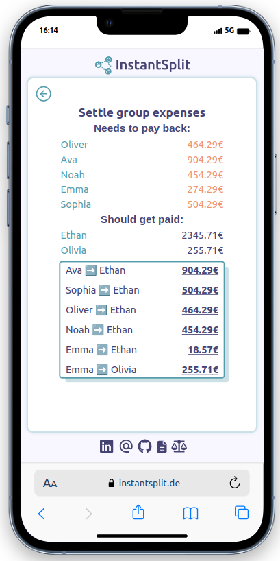

# InstantSplit

A MERN application designed for settling group expenses with a focus on functionality and minimal personal data collection, eliminating the need for personalized user registration & app installation.

## Project Status

- I had the project idea recently, after each of my friends had to download an app to settle our shared trip expenses.
- As a web development student open to internships and entry-level developer roles, I embarked on this project with the dual purpose of learning and showcasing my skills, while also creating a valuable tool for others to benefit from.
- Although this project will continue in ongoing development, I'm delighted to announce that, with the release of the MVP, I've successfully implemented the fundamental functionality for easy expense splitting, and the app is now ready for use.

## Learnings

- Swiftly grasped the advantages of establishing a modular project structure aligned with industry best practices and conventions. This approach significantly accelerated my progress once I initially set up the server and database.
- Furthermore, the experience of building a Full Stack App from scratch provided me with profound insights into the fundamental mechanics of web applications.
- While I had acquired knowledge in JavaScript and related technologies for both Frontend and Backend, I grappled with uncertainty regarding my career path. However, as I delved into the development of this app, I swiftly developed an appreciation for the immediate rewards of actually seeing results and recognized the beauty of React. Consequently, I've chosen to initially focus on Frontend as my primary career path.

## Demo

You can check out the live demo of the app [here](https://instantsplit.netlify.app/) once the MVP is deployed in Q4 2023.
