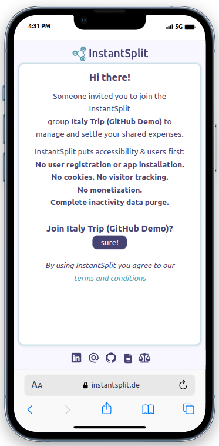
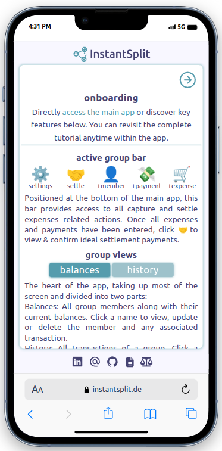
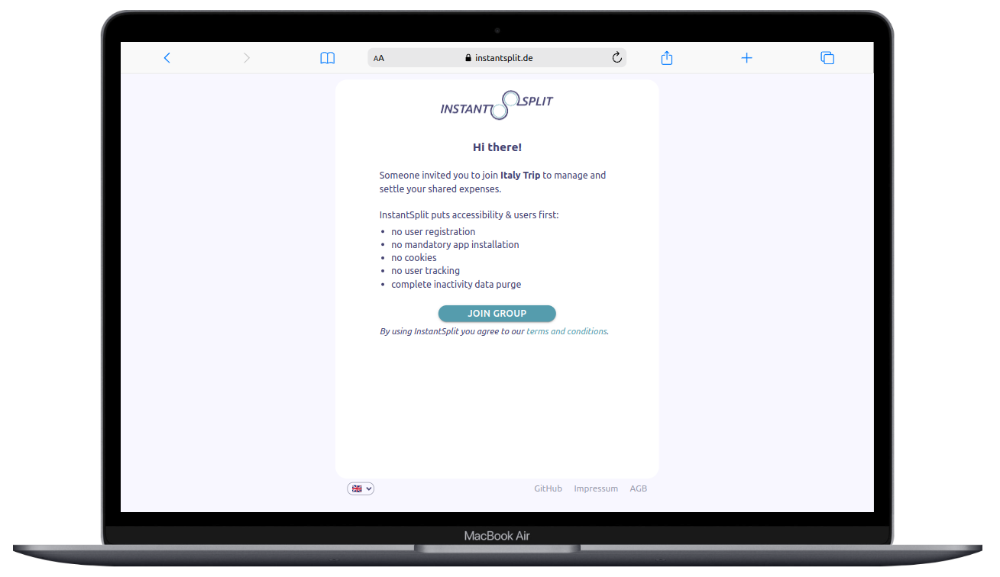

# InstantSplit

A user centered MERN Full Stack application designed for settling group expenses with a focus on functionality and data privacy, eliminating the need for personalized user registration and app installation. Allows gaining and sharing access to a group via a simple link and managing an unlimited number of such groups. Prioritizes privacy by not identifying or logging individual users and sessions and by purging all data of a group after 90 days of group inactivity.

  
  

  
    
  

## About

- **Project idea**: Frustrated with the need for each of my friends to download an app to settle our shared trip expenses, I decided to build InstantSplit to fill in the gap.
- **Project purpose**: In September 2023, when I was still a Web Development student, I took on this project to continue learning and showcase my coding skills while creating a practical tool for others.
- **Project status**: The application has been fully functional since the release of the MVP on 03/10/2023 and will continue to receive occasional improvements.

## Technologies

## Access the application or try the demo.

- Access the [application](https://www.instantsplit.de/): Create your own group, start adding users, expenses and settle payments.
- Alternatively, [join](https://instantsplit.de/join-instantsplit-group/Italy%20Trip%20GitHub%20Demo/UO99CWXD) the demo group with test data for a better immediate understanding of the application's main functionalities. Feel free to explore and add or amend test data.

## Acknowledgements

- Shoutouts to [@jstayton](https://github.com/jstayton) and his truly amazing [piratepx](https://github.com/piratepx) tool. It's a super simple to implement yet powerful beauty providing exactly what I needed: privacy-respecting usage insights without spying on my users. I just love it, thanks!

## Learnings

- **Phase 1 (Delivering the MVP):**

  - I started out with a "You can always refactor later" attitude, focusing on releasing a functional MVP ASAP.
  - Initially, I put more effort into setting up a modular project structure that aligns with industry conventions and best practices compared to my previous projects. While coding the app, I quickly realized its immense benefits, allowing me to add functionalities, especially on the client side, much easier and quicker.
  - Building a Full Stack app from scratch for the very first time also provided me with highly valuable insights into the fundamental mechanics of web applications which also gave me the confidence of being able to code and deploy a proper application.
  - Most importantly, after having learned JavaScript as well as Frontend and Backend fundamentals, I was uncertain about my initial career path. While coding this app, I quickly recognized the beauty of React and the benefit of immediate visual results and decided to focus on Frontend as my initial career path.

- **Phase 2 (Refactor client)**:
  - After having worked on a group project as a React developer, I returned to InstantSplit in January 2024 thinking I'd only apply some new learnings from that project but ended up refactoring the entire client codebase. This involved making it more modular, standardizing my code, establishing my own coding style, and also writing cleaner code in general.
  - In Phase 1, I had coded with the application user in mind. In Phase 2, I had potential colleagues in mind and aimed at setting up a project structure and writing code in a way that requires a minimum amount of explanatory comments.
  - I ended up significantly shortening the codebase while creating a more robust, easier-to-maintain and amend codebase with fewer unwanted side effects. Simultaneously, it should now be much easier to comprehend by others.
